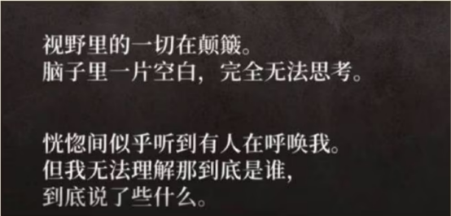
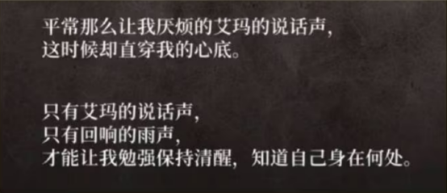
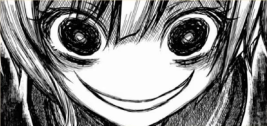
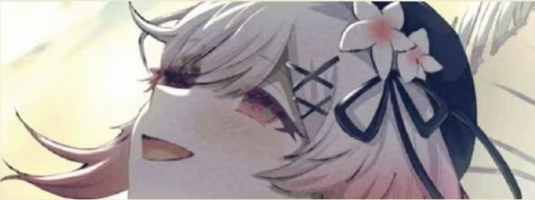

> 转自 NGA 论坛

以下是 lz 前言不搭后语的发癫时间（约 2K 字），可略过不看：

都说共犯关系是最性感又最危险的私密关系。烙印于彼此眼中的罪恶，夜空下只有两人知道的秘密……在共犯关系达成的一瞬，毫无疑问——两个人是心意相通相爱的

对于以正义为信条、永远走在正确道路上的希罗来说，亲手犯下杀人大罪的冲击足以让她在绝望迷失自我

>   
> 视野里的一切在颠簸  
> 脑子里一片空白，完全无法思考

“艾玛呢……？艾玛在干什么……？”

“在雨声的掩护下，艾玛开始用力踢打阳台的栏杆”

“无法理解艾玛在干什么。  
现在的我无法正常思考，连站都站不起来。”

“她开始收拾房间  
像是要把争执的痕迹全部去除一样。”

“艾玛这么拼命，到底是为了什么——”

“为了谁——”

杀人是**错误**的，是**不正确**的  
掩盖杀人的罪行毫无疑问也是错误的，是不正确的

自己所嫌恶的、自己所厌弃的、自己所憎恨的那个人，正在自己眼前施行看绝不可饶恕的罪

然而无法容忍错误的希罗，陷入绝望的希罗，这一次却——

>   
> 平常那么让我厌烦的艾玛的说话声。  
> 这时候却直穿我的心底。  
> 只有艾玛的说话声，  
> 只有回响的雨声，  
> 才能让我勉强保持清醒，知道自己身在何处

希罗拥抱了自己所憎恶的罪，在这一刻，她与艾玛沦为了共犯——
   
   
 

——啊，打住
 
stop
   
虽然共犯这一块也挺美味啦，但是我现在没心情品味

因为，看这段剧情时，另一种感情带给我的冲击，远远盖过了共犯的甜美——

   
 

> “活下去，希罗酱”  
> “求求你，要活下去……！”

啊啊，纯洁的艾玛，善良的艾玛

好孩子艾玛，乖孩子艾玛

这一刻，我第一次对名为[樱羽艾玛]的女性——**_感到了恐惧_**
   
我刚刚提到了“共犯关系”的美味之处……共犯关系一般有两种，一种是双方都弄脏了双手，怀抱看相同罪孽的两人于刀尖上起舞；另一种则是只有一方犯下罪孽，原本站在岸上的无罪之人为了对方主动踏入了无底的泥潭

毫无疑问，艾玛在这里属于后者

但是，通常来说第二种“共犯关系”是一种不平等的关系，

“别害怕”“别担心”“交给我”“我来帮你了”“我会救你”“一起来想办法吧”——即使主动踏入泥潭的一方没有这个本意，也还是会不知不觉的站在“施舍”的一方
   
然而，在这样一种不平等的关系中——**“求求你，要活下去……！”**——

——本该站在更高位置的、本该站在“施舍”一方的艾玛，胆怯着、颤抖着、以近乎低声下气的语气哀求——**“活下去，求求你，活下去”**，那卑微又悲切的语气，仿佛她才是那个犯了错等着被拯救的可怜人
   
——**_求你了，为了我，活下去吧_**
 
我仿佛能听到她这么说

我甚至不敢把自己放在希罗的位置上设身处地的思考她的感受

如果有朝一日，我犯下了不可挽回的，杀人的大罪，在我身边有这样一个楚楚可怜的、对我百依百顺的女孩子替我收拾残局，清理证据，然后对我说

 &emsp;&emsp;“活下去”  
 ——杀人是不对的   
 &emsp;&emsp;“活下去”   
 ——可是……   
 &emsp;&emsp;“求求你，要活下去……”   
 ——既然艾玛都这么**求**我了，就当是为了她，我也不能接受制裁   
 &emsp;&emsp;“求求你，要活下去”   
 —— ……

>    
> **——我想脱罪不是我的错，我可是为了艾玛啊，我没有错吧？！**

她是魔女

这又引申出了艾玛另一个可怕的魔性

之前希罗说，艾玛会为了博取同情和关心自导自演欺骗别人，我觉得这没什么，这些行为在我看来都只是“怕寂寞”“怕孤独”的要一点小心思，艾玛这些行为其实是一种不自觉“魅惑”“勾引”他人的天赋，如果仅仅是这样其实还不是什么大问题，远远称不上希罗所说的“邪恶”

但这份天赋叠加上艾玛的另一个特质，就会化作可怕的魔性

这份特质叫“接纳”“包容”

刚才说了，杀人是罪，包庇杀人也是罪

如果是经过取证发现凶手另有其人还好说，艾玛是还没开始查证、以希罗是杀害安安区手的情况下伪造现场，与希罗成为了共犯——

——也就是说，**只要被艾玛爱上，她会连你的罪、你的肮脏也一并接纳**

她接纳了亚里沙（纵火 BE），她接纳了梅露露（共犯 BE)，如今她又接纳了希罗

她在散发着引诱别人对她犯错的气场的同时，连别人肮脏的、罪恶的、不堪入目的东西也一并接纳了

艾玛是怕孤独的孩子，艾玛是怕寂寞的孩子，她是个不依存别人、不攀附别人、不寄生别人就活不下去的可怜的孩子

但是在这楚楚可怜的背后，隐藏看致命的危险性——她不是只会寄生别人，她会在不知不觉间把她所寄生的、依存的人，也反过来变成“没有艾玛就活不下去的身体”

**_连杀人这种罪孽，艾玛都会接纳我、保护我，那么就算我堕落的再深一点……也没关系……的……吧……？_**

现在艾玛还只是个刚刚初中毕业的孩子，现在这些都仅仅是她“怕寂寞”而采取的近似求生本能的无自觉行为，可如果有朝一日，成熟后的艾玛意识到她的这份魔性可以成为让自己活的更加舒适的武器时，会怎么样呢？

如果不将这份魔性加以抑制……有朝一日，她会化作冠以爱欲之名的兽人类恶吧

如果艾玛在人耳边吐露出这样的话语：

>   
> 啊啊，可以哦，可以做  
>  
> 无论你怎么杀生  
> 无论你怎么偷窃  
> 无论你怎么行淫  
> 无论你是个多～么差劲的人类  
> 我都会爱  
> 哪怕你堕入地狱，  
> 我 也 会 爱

又有几人能拒绝艾玛的这份爱呢？
伽摩的这段话，放在艾玛身上真是再合适不过了
   
   
   
樱羽艾玛，

她是慢慢渗入你五脏六腑的、带毒的蜜糖

她是温柔缠绕在脖颈，在耳鬓厮磨吐信、诱你吃下禁果的蛇

月代雪说，想看纯洁的艾玛杀人、想看她堕落到多么肮脏？

不不不，你错了，小雪，你错了，你还是不懂啊，让艾玛落得污秽不堪简直就是暴天物
   
艾玛必须一直纯洁  
艾玛必须一直善良  
艾玛必须一直用她那楚楚可怜的、清纯的、包容的、慈爱的姿态，引诱她身边的人源源不断的堕落、腐坏、发臭、流脓
   
引诱他人随入万劫不复的无罪魔女  
立于污秽之海却圣洁不染的邪崇神像  
这才是樱羽艾玛该有的、最完美的姿态
   
   
樱羽艾玛

纯洁的艾玛，善良的艾玛

好孩子艾玛，乖孩子艾玛
   
你——

果
然
   
是**恶**啊
