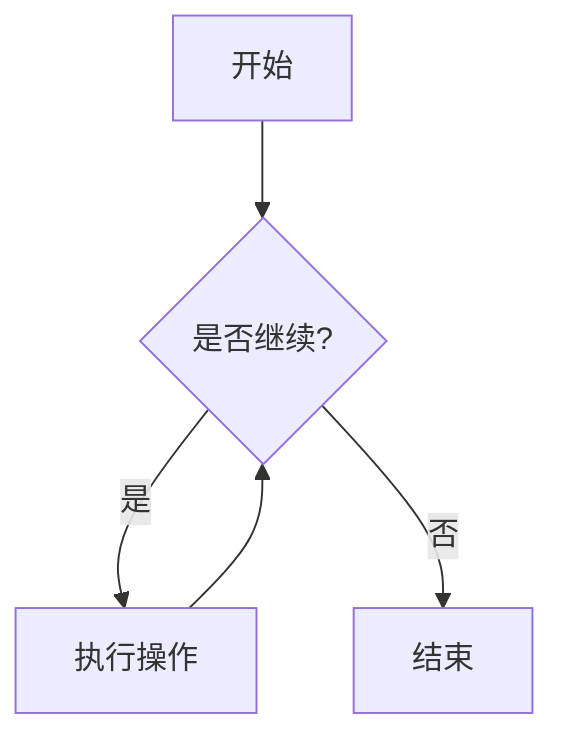

# Zensical 完全使用教程

## 前言

### Zensical 是什么？

Zensical 是一个现代化的静态站点生成器（Static Site Generator，SSG），由 Material for MkDocs 的创建者 Martin Donath（Squidfunk）开发，旨在简化项目文档的构建和维护工作。正如其创作者所说，Zensical 是“一个工具，让你可以从一个文本文件夹构建出漂亮的网站”——你只需用 Markdown 写作，运行构建命令，就能得到一个完整的静态 HTML 网站，内置现代化设计、搜索、代码注解、提示框等功能。

Zensical 的核心技术采用了 Rust + Python 的混合架构，其核心用 Rust 编写以追求极致性能，同时通过 PyO3 提供 Python 绑定，让用户可以使用 Python 编写扩展模块而无需学习 Rust。Zensical 基于 MIT 许可证完全开源，可通过 `pip` 安装，由 GitHub 上的 Zensical 组织维护。

### 为什么选择 Zensical？

- **电池内置（Batteries Included）**：开箱即用，无需繁琐配置即可获得完整功能。
- **高性能**：基于 Rust 的核心引擎支持增量构建，毫秒级构建速度，可从单页面扩展到十万级页面。
- **现代化设计**：内置现代 UI，支持明/暗主题切换、响应式布局、即时导航等特性。
- **强大的写作体验**：全面扩展的 Markdown 语法，支持代码注解、提示框、Mermaid 图表、数学公式、内容标签页等。
- **无缝迁移**：与 Material for MkDocs 生态系统高度兼容，现有 MkDocs 用户可平滑迁移。
- **免费开源**：完全免费，MIT 许可证，社区驱动持续演进。

### 本文适合哪些读者

- 想要为开源项目搭建文档网站的开发者
- 希望建立个人技术博客或知识库的写作者
- 正在使用 MkDocs / Material for MkDocs，考虑迁移到下一代工具的用户
- 对静态站点生成器感兴趣的技术爱好者

---

## 第一章：环境准备

### 系统要求

在安装 Zensical 之前，请确保你的系统满足以下条件：

- **Python 3.8 或更高版本**。Zensical 以 Python 包的形式发布，推荐使用 Python 3.9 或更高版本以获得最佳性能。
- **pip 包管理器**。现代 Python 发行版通常已包含 pip。
- 支持的操作系统：macOS、Linux、Windows。

### 检查 Python 版本

在终端中执行以下命令：

```bash
python3 --version   # macOS / Linux
# 或
python --version    # Windows
```

如果版本低于 3.8，请先升级 Python。你可以从 [python.org](https://www.python.org/) 下载最新版本。

### 创建项目目录

选择一个合适的位置创建你的 Zensical 项目目录：

```bash
mkdir my-zensical-site
cd my-zensical-site
```

---

## 第二章：安装 Zensical

### 使用虚拟环境（强烈推荐）

Zensical 强烈建议使用 Python 虚拟环境进行安装，这样可以避免不同项目之间的依赖冲突。

#### macOS / Linux

```bash
# 1. 创建虚拟环境
python3 -m venv .venv

# 2. 激活虚拟环境（激活后，终端提示符前会显示 (.venv)）
source .venv/bin/activate

# 3. 升级 pip（推荐）
pip install --upgrade pip

# 4. 安装 Zensical
pip install zensical

# 5. 验证安装
zensical --version
```

#### Windows

```bash
# 1. 创建虚拟环境
python3 -m venv .venv

# 2. 激活虚拟环境（激活后，终端提示符前会显示 (.venv)）
.venv\Scripts\activate

# 3. 升级 pip（推荐）
pip install --upgrade pip

# 4. 安装 Zensical
pip install zensical

# 5. 验证安装
zensical --version
```

### 使用 uv 安装（开发者推荐）

如果你已经是 Python 开发者，可能正在使用 `uv` 作为包管理工具。以下是使用 `uv` 安装 Zensical 的方法：

```bash
# 初始化项目
uv init

# 添加 Zensical
uv add zensical

# 验证安装
uv run zensical --version
```

使用 `uv` 时，始终通过 `uv run` 或在激活的项目虚拟环境中执行 `zensical` 命令。

### 使用 Docker

如果你熟悉 Docker，也可以使用官方 Docker 镜像：

```bash
docker pull zensical/zensical
docker run --rm -v $(pwd):/docs zensical/zensical zensical build
```

详细说明请参考 [Docker Hub 文档](https://hub.docker.com/r/zensical/zensical)。

### 常见安装问题

- **权限错误**：如果遇到权限错误，可以尝试 `pip install --user zensical`，或使用 `sudo pip install zensical`（不推荐）。
- **网络问题**：如果 pip 安装缓慢，可以换用国内镜像源（如清华、阿里云等）。
- **版本冲突**：请务必在虚拟环境中安装，这是避免冲突的最佳实践。

---

## 第三章：创建你的第一个 Zensical 项目

### 初始化项目

在项目目录中运行以下命令：

```bash
# 确保虚拟环境已激活（如果尚未激活）
# macOS / Linux: source .venv/bin/activate
# Windows: .venv\Scripts\activate

# 在当前目录创建新项目
zensical new .
```

`zensical new .` 中的 `.` 表示在当前目录创建项目。如果你希望在子目录中创建，可以指定路径：`zensical new my-site`。

### 项目结构解析

创建完成后，你应该看到以下目录结构：

```
.
├── .github/
│   └── workflows/
│       └── ci.yml          # GitHub Actions 工作流（用于自动部署）
├── docs/                   # 文档源文件目录
│   └── index.md            # 网站首页
├── zensical.toml           # Zensical 配置文件
└── ...                     # 其他项目文件
```

各目录和文件的作用：

| 路径                       | 说明                                              |
| -------------------------- | ------------------------------------------------- |
| `docs/`                    | Markdown 源文件存放目录，所有网站内容都在这里编写 |
| `docs/index.md`            | 网站首页，这是你网站的入口页面                    |
| `zensical.toml`            | 主配置文件，控制网站的几乎所有行为                |
| `.github/workflows/ci.yml` | 自动部署配置文件（如果你使用 GitHub）             |

### 常用 CLI 命令

Zensical 在命令行中使用 `zensical` 作为命令名，语法形式为：`zensical COMMAND [OPTIONS] [ARGS]...`

| 命令                    | 说明                           |
| ----------------------- | ------------------------------ |
| `zensical serve`        | 启动本地预览服务器             |
| `zensical build`        | 构建静态站点（生成 HTML 文件） |
| `zensical new`          | 创建新项目                     |
| `zensical --help`       | 查看所有命令的帮助信息         |
| `zensical build --help` | 查看特定命令的详细帮助         |

---

## 第四章：配置文件详解

`zensical.toml` 是 Zensical 的核心配置文件，采用 TOML 格式。以下是一个基础配置示例：

```toml
# 项目基本信息
[project]
site_name = "我的 Zensical 网站"
site_description = "这是一个使用 Zensical 构建的文档网站"
site_url = "https://example.com"
site_dir = "site"              # 构建输出目录（默认 site）
use_directory_urls = true      # 是否使用目录式 URL（例如 /about/ 而非 /about.html）

# 文档源目录
docs_dir = "docs"              # Markdown 源文件目录（默认 docs）

# 主题配置
[project.theme]
variant = "modern"             # 主题风格：modern（现代）或 classic（经典）

# 颜色方案
[project.theme.palette]
scheme = "default"             # 颜色主题：default（亮色）或 slate（暗色）
primary = "indigo"             # 主色
accent = "indigo"              # 强调色

# 导航配置
[project.theme.features]
navigation_instant = true      # 启用即时导航（无刷新页面切换）
navigation_tabs = true         # 启用顶部标签导航

# 插件配置
[project.plugins]
search = true                  # 启用内置搜索（默认开启）
```

### 配置说明

- **site_name**：网站名称，显示在页面标题栏和导航栏。
- **site_description**：网站描述，用于 SEO。
- **site_url**：网站的完整 URL，对于即时导航等功能的正常工作是必需的。
- **site_dir**：构建后的静态文件输出目录，默认为 `site`。
- **use_directory_urls**：设为 `true` 时，页面 URL 会使用目录形式（如 `/about/`），更适合 SEO。

---

## 第五章：内容创作基础

### Markdown 基础

Zensical 的核心内容创作语言是 Markdown。你所有的页面内容都以 `.md` 文件的形式存放在 `docs/` 目录下。

最简单的 Markdown 示例（`docs/index.md`）：

```markdown
# 欢迎来到我的网站

这是我的第一个 Zensical 网站。

## 关于我

我是一个开发者，热爱分享技术知识。
```

### Front Matter（元数据）

你可以在 Markdown 文件顶部添加 Front Matter 来定义页面级别的元数据。Front Matter 使用 YAML 格式，以 `---` 包裹：

```yaml
---
title: 关于我们
description: 这是关于我们页面的描述
hide:
  - navigation # 隐藏导航栏
  - toc # 隐藏目录
---
# 关于我们

这里是页面的主要内容...
```

### 页面标题自动提取

Zensical 会自动从 Markdown 文件的第一级标题（`# 标题`）中提取页面标题，用于导航栏和页面标题栏。

---

## 第六章：进阶写作——Markdown 扩展语法

Zensical 不仅支持标准 Markdown 语法，还集成了大量强大的扩展功能，让你能够写出专业、交互性强的技术文档。

### 提示框（Admonitions）

提示框能在不打断正文流的前提下，突出显示重要信息、警告或建议。Zensical 内置了 12 种提示类型。

**基础用法：**

```markdown
!!! note
这是一个 **note（提示）** 类型的提示框，用于提供有用的信息。

!!! warning
这是一个 **warning（警告）** 类型的提示框，请小心！
```

**自定义标题：**

```markdown
!!! tip "小技巧：提升写作效率"
使用 `zensical serve` 实时预览文档变更。
```

**可折叠区块（Details）：**

通过 `???` 替代 `!!!`，可创建默认折叠的区块，非常适合 FAQ 或长说明：

```markdown
??? info "点击展开查看更多信息"
此内容默认隐藏，点击后展开。
非常适合用于常见问题（FAQ）或较长的说明。
```

若想默认展开，使用 `???+`。

**支持的所有提示类型：**

| 类型       | 用途     |
| ---------- | -------- |
| `note`     | 一般提示 |
| `abstract` | 摘要     |
| `info`     | 信息说明 |
| `tip`      | 使用技巧 |
| `success`  | 成功状态 |
| `question` | 常见问题 |
| `warning`  | 警告     |
| `failure`  | 失败提示 |
| `danger`   | 严重风险 |
| `bug`      | 已知缺陷 |
| `example`  | 示例     |
| `quote`    | 引用     |

### 代码块与语法高亮

Zensical 支持多种编程语言的语法高亮，并可添加代码注解：

````markdown
```python
def hello():
    print("Hello, Zensical!")
```
````

**代码注解：**

````markdown
```python
def hello():  # (1)!
    print("Hello, Zensical!")

1.  这是 `hello` 函数的定义，它会打印一条欢迎信息。
```
````

````

### 内容标签页（Content Tabs）

当需要展示不同语言或环境的代码示例时，内容标签页非常有用。首先需要在配置中启用：

```toml
[project.markdown_extensions]
pymdownx.tabbed = { alternate_style = true }
````

然后这样使用：

````markdown
=== "Python"

    ```python
    print("Hello from Python!")
    ```

=== "JavaScript"

    ```javascript
    console.log("Hello from JavaScript!");
    ```

=== "Bash"

    ```bash
    echo "Hello from Bash!"
    ```
````

标签页会自动生成锚点链接，方便分享。

### Mermaid 图表

Zensical 支持 Mermaid 图表语法，可以轻松嵌入流程图、时序图等：

````markdown

````

### 数学公式（LaTeX）

使用 `$$` 包裹可以嵌入 LaTeX 数学公式：

```markdown
$$
E = mc^2
$$

当 $a \ne 0$ 时，一元二次方程 $ax^2 + bx + c = 0$ 的解为：

$$
x = \frac{-b \pm \sqrt{b^2 - 4ac}}{2a}
$$
```

### 脚注

```markdown
这里是一段文字，需要添加脚注[^1]。

[^1]: 这是脚注的内容，显示在页面底部。
```

### 任务列表

```markdown
- [x] 已完成的任务
- [ ] 待完成的任务
- [ ] 另一个待完成的任务
```

### 定义列表

```markdown
`zensical serve`
: 启动本地预览服务器，支持热重载

`zensical build`
: 构建静态站点到输出目录
```

---

## 第七章：博客系统

Zensical 内置了功能强大的博客插件，无需额外安装即可开箱即用。它支持文章管理、自动生成博客索引和存档、标签系统、日期管理、作者信息、阅读时间计算、草稿功能等。

### 项目结构

要启用博客功能，需要在 `docs/` 目录下创建以下结构：

```
docs/
├── blog/
│   ├── index.md              # 博客首页（必需）
│   ├── .authors.yml          # 作者信息文件（可选）
│   ├── posts/                # 博客文章目录
│   │   ├── 2025-01-22-first-post.md
│   │   ├── 2025-01-23-second-post.md
│   │   └── ...
│   └── archive.md            # 博客存档页面（可选）
└── index.md                  # 网站首页
```

> **重要**：`blog/index.md` 文件是必需的，没有这个文件博客功能无法正常工作。

### 配置博客插件

在 `zensical.toml` 中添加以下配置：

```toml
[project.plugins.blog]
# 日期格式：full（完整）、medium（中等）、short（简短）
post_date_format = "full"

# 显示阅读时间
post_readtime = true
post_readtime_words_per_minute = 265    # 中文适配（推荐值）

# 启用草稿功能
draft = true
draft_if_future_date = true            # 自动将未来日期的文章标记为草稿

# 文章 URL 格式
post_url_format = "{date}/{slug}"

# 分页设置
pagination_per_page = 10
pagination_url_format = "page/{page}"

# 作者信息文件（可选）
authors_file = "blog/.authors.yml"
```

只需在配置文件中添加 `[project.plugins.blog]` 即可启用博客功能，所有配置都有合理的默认值。

### 创建博客文章

创建一篇新文章，文件名格式建议为 `YYYY-MM-DD-title.md`，例如 `docs/blog/posts/2025-01-22-my-first-post.md`：

```markdown
---
title: 我的第一篇博客文章
date: 2025-01-22
authors:
  - name: 你的名字
    email: your@email.com
categories:
  - 技术
  - Python
tags:
  - Zensical
  - 教程
draft: false
---

# 我的第一篇博客文章

这是文章的内容...你可以尽情写作。
```

### Front Matter 字段详解

| 字段         | 类型   | 说明                               |
| ------------ | ------ | ---------------------------------- |
| `title`      | 字符串 | 文章标题（必需）                   |
| `date`       | 日期   | 发布日期，格式：YYYY-MM-DD（必需） |
| `authors`    | 数组   | 作者信息列表                       |
| `categories` | 数组   | 文章分类                           |
| `tags`       | 数组   | 文章标签                           |
| `draft`      | 布尔值 | 是否为草稿（默认：false）          |
| `comments`   | 布尔值 | 是否启用评论（默认：true）         |

---

## 第八章：导航与搜索

### 导航配置

Zensical 默认根据文件夹结构和 Markdown 文件自动生成导航侧边栏。你也可以显式定义导航结构以获得更多控制权：

```toml
[project.nav]
"首页" = "index.md"
"指南" = [
    "getting-started.md",
    "configuration.md",
    "writing.md"
]
"关于" = "about.md"
"GitHub" = "https://github.com/your/repo"    # 外部链接
```

### 导航层级（导航区段）

你可以定义多级导航结构：

```toml
[project.nav]
"开始" = [
    "index.md",
    "installation.md"
]
"用户指南" = [
    "usage/basic.md",
    "usage/advanced.md"
]
"API参考" = "api/index.md"
```

### 即时导航（Instant Navigation）

即时导航是 Zensical 的一大亮点功能。启用后，所有内部链接的点击都会被拦截并通过 XHR 处理，无需完整刷新页面，使网站像单页应用（SPA）一样流畅：

```toml
[project.theme.features]
navigation_instant = true          # 启用即时导航
navigation_instant_progress = true # 显示进度指示器（慢速连接时自动显示）
navigation_instant_prefetch = true # 实验性功能：鼠标悬停时预加载页面
```

> 使用即时导航时，**必须**在配置文件中设置 `site_url`，因为即时导航依赖于生成的 `sitemap.xml`。

### 内置搜索功能

Zensical 提供了完全客户端的搜索功能，无需集成第三方服务，符合隐私保护要求，并且支持离线使用：

```toml
[project.plugins]
search = true    # 默认即开启，无需额外配置
```

**启用搜索高亮：**

```toml
[project.theme.features]
search_highlight = true    # 点击搜索结果后高亮显示所有匹配内容
```

**排除特定页面或区块：**

```markdown
---
search:
  exclude: true
---

# 此页面不会出现在搜索结果中
```

---

## 第九章：主题与样式定制

### 主题变体

Zensical 提供了两种主题风格：

```toml
[project.theme]
variant = "modern"    # 现代风格（默认）
# variant = "classic"  # 经典风格
```

### 颜色方案

Zensical 支持灵活的颜色配置，包括亮色/暗色模式切换：

```toml
[project.theme.palette]
scheme = "default"      # 颜色方案：default（亮色）或 slate（暗色）
primary = "indigo"      # 主色
accent = "indigo"       # 强调色
```

**支持的预定义颜色：**

- 主色（Primary）：`red`、`pink`、`purple`、`deep-purple`、`indigo`、`blue`、`light-blue`、`cyan`、`teal`、`green`、`light-green`、`lime`、`yellow`、`amber`、`orange`、`deep-orange`、`brown`、`grey`、`blue-grey`、`black`、`white`
- 强调色（Accent）：`red`、`pink`、`purple`、`deep-purple`、`indigo`、`blue`、`light-blue`、`cyan`、`teal`、`green`、`light-green`、`lime`、`yellow`、`amber`、`orange`、`deep-orange`

### 亮色/暗色模式切换

为用户提供明暗主题切换按钮：

```toml
[[project.theme.palette.toggles]]
scheme = "default"
icon = "lucide/sun"
name = "切换到亮色模式"

[[project.theme.palette.toggles]]
scheme = "slate"
icon = "lucide/moon"
name = "切换到暗色模式"
```

### 跟随系统偏好

自动跟随操作系统的颜色方案设置：

```toml
[[project.theme.palette.toggles]]
scheme = "default"
media = "(prefers-color-scheme: light)"
icon = "lucide/sun"
name = "切换到亮色模式"

[[project.theme.palette.toggles]]
scheme = "slate"
media = "(prefers-color-scheme: dark)"
icon = "lucide/moon"
name = "切换到暗色模式"
```

### 自定义 CSS

如果需要超越预设颜色范围（例如使用品牌专属色），可以添加额外的样式表并调整 CSS 变量值。

创建 `docs/stylesheets/extra.css` 文件：

```css
:root {
  --md-primary-fg-color: #ff6b6b;
  --md-accent-fg-color: #4ecdc4;
}
```

然后在配置文件中引用：

```toml
[project.extra_css]
"stylesheets/extra.css"
```

---

## 第十章：部署你的网站

静态站点生成后，可以部署到多种平台。以下是最常见的几种部署方式。

### 使用 GitHub Pages 部署（推荐）

如果你已经在 GitHub 上托管代码，GitHub Pages 是最方便的免费部署方式。

**第一步：创建 GitHub Actions 工作流**

在项目根目录创建 `.github/workflows/docs.yml` 文件：

```yaml
name: Documentation

on:
  push:
    branches:
      - master
      - main

permissions:
  contents: read
  pages: write
  id-token: write

jobs:
  deploy:
    environment:
      name: github-pages
      url: ${{ steps.deployment.outputs.page_url }}
    runs-on: ubuntu-latest
    steps:
      - uses: actions/configure-pages@v5
      - uses: actions/checkout@v5
      - uses: actions/setup-python@v5
        with:
          python-version: 3.x
      - run: pip install zensical
      - run: zensical build --clean
      - uses: actions/upload-pages-artifact@v4
        with:
          path: site
      - uses: actions/deploy-pages@v4
        id: deployment
```

**第二步：在 GitHub 仓库中启用 Pages**

1. 进入你的 GitHub 仓库，点击 **Settings**（设置）
2. 在左侧菜单中找到 **Pages**
3. 在 Source 部分，选择 **GitHub Actions**

**第三步：推送代码**

```bash
git add .
git commit -m "Initial Zensical site"
git push origin main
```

推送后，GitHub Actions 会自动构建并部署。你的网站将出现在 `https://<username>.github.io/<repository>/`。

### 使用 GitLab Pages 部署

在项目根目录创建 `.gitlab-ci.yml` 文件：

```yaml
image: python:3.11

pages:
  stage: deploy
  script:
    - pip install zensical
    - zensical build --clean
  artifacts:
    paths:
      - public
  only:
    - main
```

> GitLab Pages 要求输出目录名为 `public`，请在配置文件中设置 `site_dir = "public"`。

### 使用 Netlify 部署

Netlify 也提供了自动构建和部署功能，推送代码即可触发部署：

1. 在 Netlify 中导入你的 Git 仓库
2. 设置构建命令：`zensical build --clean`
3. 设置发布目录：`site`
4. 保存即可自动部署

---

## 第十一章：常见问题与技巧

### 从 MkDocs 迁移

如果你正在使用 MkDocs / Material for MkDocs，迁移到 Zensical 非常平滑。主要注意事项：

| 项目                   | MkDocs   | Zensical                                 |
| ---------------------- | -------- | ---------------------------------------- |
| 命令名                 | `mkdocs` | `zensical`                               |
| `--theme` 参数         | 支持     | 不支持（请在配置文件中设置）             |
| `--use-directory-urls` | 支持     | 不支持（请在配置文件中设置）             |
| `gh-deploy`            | 支持     | 不提供（使用 GitHub Actions 等 CI 方式） |

### 开发工作流

推荐的开发流程：

1. **编写内容**：在 `docs/` 目录下编写 Markdown 文件
2. **本地预览**：运行 `zensical serve`，在 `http://127.0.0.1:8000` 实时预览
3. **提交代码**：确认无误后提交到 Git 仓库
4. **自动部署**：CI 系统自动构建并部署到线上环境

### 性能优化建议

- **启用即时导航**：提升页面切换体验
- **使用增量构建**：Zensical 默认使用缓存加速构建，无需手动配置 `--dirty` 参数
- **合理组织内容**：将大型文档拆分为多个小页面，提高加载速度

### 版本更新与维护

定期更新 Zensical 以获取最新功能和修复：

```bash
pip install --upgrade zensical
```

建议在更新后重新构建并预览网站，确保兼容性。

### 获取帮助与参与社区

- **官方网站**：[https://zensical.org](https://zensical.org)
- **官方文档**：[https://zensical.org/docs](https://zensical.org/docs)
- **GitHub 仓库**：[https://github.com/zensical/zensical](https://github.com/zensical/zensical)
- **PyPI 页面**：[https://pypi.org/project/zensical](https://pypi.org/project/zensical)

Zensical 仍处于积极开发阶段，欢迎试用并提供反馈。中文社区资源方面，可以参考 wcowin 维护的中文教程（[wcowin.work/Zensical-Chinese-Tutorial](https://wcowin.work/Zensical-Chinese-Tutorial/)），该教程与官方文档保持对齐。

---

## 总结

本教程涵盖了 Zensical 从安装配置到部署上线的完整流程。总结一下关键步骤：

1. **环境准备**：确保 Python 3.8+，创建项目目录
2. **安装**：在虚拟环境中通过 pip 安装 Zensical
3. **创建项目**：运行 `zensical new .` 初始化项目
4. **编写内容**：使用 Markdown 写作，充分利用扩展语法（提示框、代码注解、Mermaid 图表等）
5. **配置定制**：编辑 `zensical.toml`，调整主题、颜色、导航、搜索等
6. **本地预览**：运行 `zensical serve` 实时查看效果
7. **构建发布**：`zensical build` 生成静态文件，部署到 GitHub Pages 等平台

Zensical 作为下一代静态站点生成器，以 Rust 核心驱动高性能构建，同时保持 Python 生态的易用性。无论你是个人博客作者、开源项目维护者，还是企业文档负责人，Zensical 都能为你提供优雅、高效的内容创作和发布体验。

开始你的 Zensical 之旅吧！
